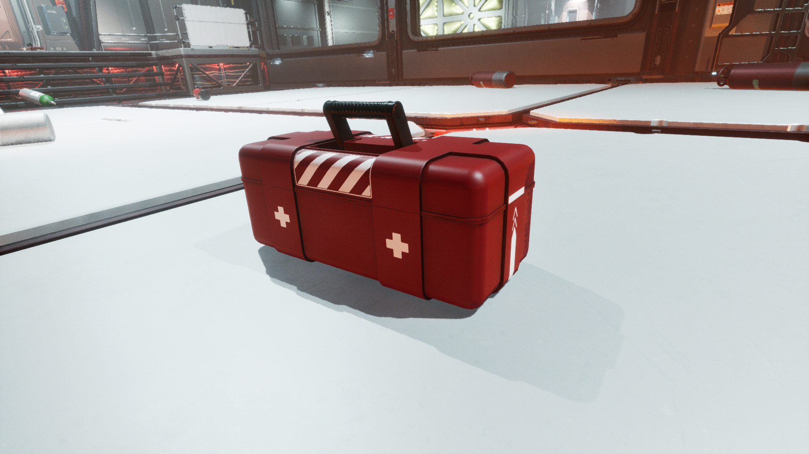

# 🛡️ SafeVision – Detecting Safe Objects with YOLO

## 📌 Overview
SafeVision is an AI-powered application built with **YOLOv8** and **Streamlit** that detects **safe objects** in images.  
Unlike typical hazard detection systems, our model focuses on identifying objects that are **non-hazardous / safe**, ensuring workplace safety monitoring and awareness.  

🌐 Live Demo: [SafeVision on Streamlit](https://safevision.streamlit.app/)

Working Demo: https://drive.google.com/file/d/1hp_ZBliVqPXsAGn0gPTTYI0WotMi4mMS/view?usp=sharing

PPT: https://docs.google.com/presentation/d/1juvunwuF9yYKBxkDsGGYNO8nTrY3bEcj/edit?usp=sharing&ouid=117159505509227965026&rtpof=true&sd=true

---

## ⚙️ Project Workflow
1. **Dataset Preparation**
   - Dataset provided by Falcon AI
   - Images divided into **Train, Validation, and Test** sets
   - Labels in YOLO format

2. **Model Training**
   - Framework: Ultralytics YOLOv8
   - Environment: Anaconda (`EDU` environment)
   - Training Command:
     ```bash
     python train.py
     ```

3. **Evaluation Metrics**
   - mAP@50, Precision, Recall
   - Confusion Matrix and Predictions

4. **Deployment**
   - Deployed using **Streamlit Cloud**
   - Supports **image upload + sample images** for predictions

---

## 📊 Results & Performance
- **Highest mAP@50**: **59%**  
- **Precision**: **85%**  
- **Recall**: **50%**

📉 Training Curve (Loss & mAP):


📈 Confusion Matrix (Test Set):


✅ Example Predictions:
| Test Image | Model Prediction |
|------------|------------------|
|  |  |
|  |  |

---

## 🚀 How to Run Locally
1. Clone the repository:
   ```bash
   git clone https://github.com/Medhaswini118/SafeVision.git
   cd SafeVision
2. Install dependencies:

pip install -r requirements.txt

3. Run the Streamlit app:

streamlit run app.py
